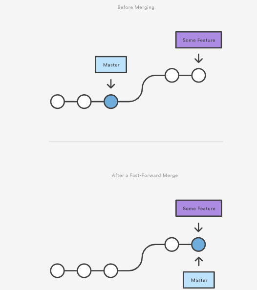
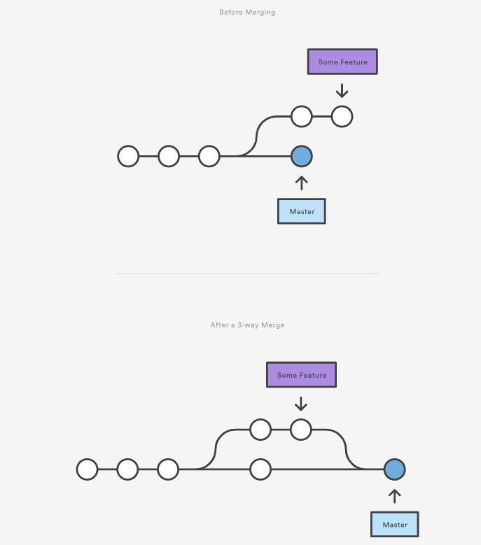

## git 생기초 배우기 2번째

## 오늘 배운 git 명령어


```
$ git remote add origin <URL> # git remote add <name> <URL>
$ git push origin master # git push <remote_name> <branch>

$ git branch
$ git branch <branch>
$ git branch -d <branch>
$ git branch -D <branch>

$ git switch <branch>
$ git switch -c <branch> == $ git checkout -b <branch>

$ git checkout <branch/commit_id>

$ git merge <branch>

$ git remote remove <remotename>
```

* `$ git remote add origin <URL>` 은 깃허브와 같은 클라우드로 경로를 지정하는 명령어이다. 여기서 origin은 이름에 해당하는 것이기에 굳이 다른 것을 쓰고 싶으면 다른 이름을 사용하면 된다
* `$ git push origin master`는 해당경로를 통해 생성하거나 수정한 git파일을 업로드하는 것이다. 최근 commit의 내용으로 올린다
* `$ git branch`는 현재 branch가 무엇이 있는 것인지 확인하는 것이다.
* `$ git banch <branch>`는 새로운 branch를 생성하는 명령어이다.
* `$ git branch -d <branch>`는 해당 branch를 삭제하는 명령어이다
* `$ git switch <branch>`는 해당 branch로 바꾸라는 명령어이다
* `$ git switch -c <branch>`는 해당 이름의 branch를 생성한 후 그 branch로 바꾸라는 명령어이다. 뒤의 `$ git checkout -b <branch>`도 비슷한 기능을 하는 명령어이다.
* `$ git checkout <branch/commit_id>`는 해당 branch의 위치로 바뀌거나 commit의 상태로 이동하는 명령어이다.
* `$ git merge <branch>`는 해당 이름의 branch를 현 위치 branch로 데이터를 합치라는 명령어이다.


## remote repo(원격 저장소)와 합병(merge)

보통 해당 컴퓨터에 repo를 만들면 그 컴퓨터에만 저장이 되고 다른 이들과 공유하고 협업하기가 어렵기 때문에, remote repo를 만들어서 같은 프로젝트를 서로 협업하기 위한 것이다. github가 대표적인 remote repo에 해당하며, 서로 repo를 공유하고 수정하면서 팀 프로젝트를 진행할 수가 있다. 그런데 같이 업무를 진행하면서 서로 변경된 파일을 합쳐야하는 상황이 오는데 이러한 합병은 크게 3분류로 나눌 수 있다.

### fast forward

중심에 해당하는 branch가 단순히 최신 데이터가 반영이 안 된 경우, 최신 데이터가 반영된 branch를 합병하게 되면 해당  branch의 상태로 업데이트 되는 것을 의미한다.  이 때 경로가 1개 뿐이고 크게 충돌하는 데이터가 없어서 바로 진행이 된다.



### 자동 merge

중심에 해당하는 branch와 다른 branch를 합병할 때, 데이터의 위치가 겹치지 않아 그자리에 바로 합쳐도 문제없다고 판단되는 경우 `$ git commit <filename>`과 비슷한 상황으로 나오며 이를 허용하면 자동으로 merge되는 것을 뜻한다.



### 수동 merge

중심에 해당하는 branch와 다른 branch를 합병할 때, 서로의 데이터의 위치가 겹쳐져서 충돌하게 되는 경우 conflict가 되며, 해당 데이터를 어떻게 처리할지 표시하고 양쪽 데이터를 임시로 남겨놓는 상태이다. 이 때는 겹치는 데이터가 뭔지 확인한 후에 수동으로 고쳐줘야 하며, 특정 branch만을 반영하려고 할 경우 해당 branch만을 기입하거나 선택하면 된다.


이렇게 만들어진 commit을 merge commit이라고 하며, 이 merge commit를 원격 저장소에 push하면 해당 commit으로 데이터가 업데이트가 된다.


git log --pretty=format:"%h %s" --graph


1. 각자 브랜치에서 작업함 (commit)
2. push도 종종함.
3. 적절한 시점에 리모트/master와 merge 함.
4. 이 때, Pull Request 를 통해서 리모트에서 원격으로 merge 진행함.
5. 리모트 merge 종료 이후, 로컬에서 master 브랜치로 origin/master 를 pull 함.(git pull origin master)
6. pull 이후에 바로 다른 브랜치 생성 => 다시 위의 작업 반복

git clone