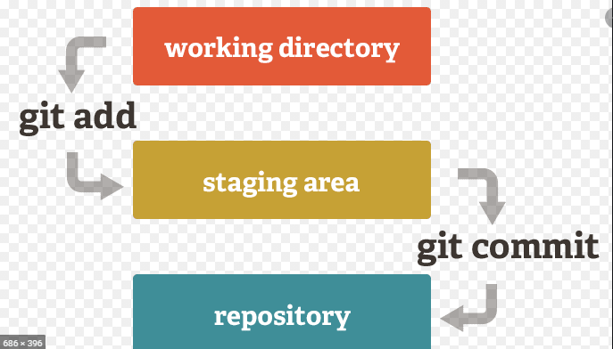

# git 생기초 배우기

## git과 github는 무엇인가?

git은 일종의 문서관리에 해당하고 hub는 관리하기 위해 모아두는 클라우드 같은 것이다. 

VCS는 version control system의 약자로 git이 여기에 해당한다.

## CLI과 GUI의 차이

+ CLI는 Command Line Interface의 약자로 text를 통해 명령 또는 편집을 하는 방식으로 오래된 방식이다. GUI보다 사용하기는 불편하지만 훨씬 더 많은 명령어를 실행시킬 수 있어서 사용법을 익히기만 하면 컴퓨터의 다양한 기능을 실행할 수 있다.
+ GUI는 Graphic User Interface의 약자로 그림이나 아이콘을 통해 명령 또는 편집을 하는 방식이다. 컴퓨터에 대한 지식이 짧은 사람이라고 직관적으로 이해하고 사용할 수는 있지만 중요기능을 잘못 건드려 컴퓨터 기능을 마비시킬 수 있기 때문에 제한적인 기능만 사용한다.

## vim에 대하여

vim은 CLI 기반으로 사용하는 프로그램으로 편집기능과 명령기능을 가지고 있다. 

vim으로 진입하면 단축키 `i`를 눌러 편집모드로 들어갈 수 있고 `esc`로 명령모드로 전환이 된다. 이는 나중에 

`$ git commit <filename>`으로 들어갔을 때와 비슷한 현상이 나온다. 

편집한 것을 저장할 때 `:W`이고 종료할 때는 `:q`이며 저장과 닫기를 동시에 할 때는 `:wq`이다.

## git 사용 기초 명령어들 ##

주의 : $는 단순 명령어를 기재할 위치라는 뜻이지 따라서 기재하면 안 되는 기호이다.

1. git을 다운받으면 git bash라는 앱을 실행한다.

2. 폴더를 정해줘야 하는데

   1. `<LAPTOPNAME> MINGW64A /
      $`

      으로 되어있으면 이는 큰 상위 폴더, 즉 "C:\"에 현재 위치하고 있다는 뜻이다.

   2. 위치를 home폴더로 바꾸고 싶으면 폴더 변경 명령어를 입력한다 폴더 명령 입력은

      `$ cd `이며, home 폴더명은 "~"이다. 상위폴더로 가고 싶으면 `$ cd ..`로 기재한다. 참고로 현재 폴더는 `.`하나만 기재하면 된다.

3. 폴더를 만드는 명령어는 `$ mkdir <foldername>`이며, 파일을 생성하려면 `$ touch <filename(확장자 포함)>`이다

4. `$ ls` 명령어는 해당 폴더에 있는 파일리스트를 의미하고 그 목록을 나열한다. `$ ls -a`는 모든 파일를 확인하기 위해서이다.

5. `$ rm <filename(확장자포함)>`은 해당파일을 삭제하는 것이다. 폴더를 지우려면 `$ rm -r <foldername>`이다.

6. 위에서 언급한 폴더는 단순이 묶음만을 의미하고 아무 기능을 하지 않기 때문에 기능을 하기 위해서는 추가적인 명령어를 입력해야 한다. 이러한 폴더를 directory라고 부른다.

## 간단한 git 사용법

1.  해당폴더에 git기능을 부여하기 위해서는 해당폴더로 위치를 옮긴 후 `$git init`을 입력해야 한다. 여기에 하위폴더마저 git기능이 부여되어있으면 하위폴더는 subgit이라 전혀 다르게 기능을 하기 때문에 반드시 git을 사용하는 상위폴더만에게 명령어를 입력한다. 이렇게 기능을 하는 폴더를 저장소(repository)라 부른다.

   

   

   git 기능을 실행하게 되면 상태창에 master라고 표시되며, 해당 기능을 삭제하고 싶으면 .git폴더를 삭제시키면 된다.

2. 만약 commit을 부여할 때 프로필이 존재하지 않으면

3. `$ git status`는 해당 깃폴더의 상태를 의미하며, 폴더 내 파일이 현재와 차이가 있는지 확인한다.

   * untracked는 아예 식별한 적이 없는 파일을 뜻한다.

   * unmodified는 현재와 식별된 상태가 같음을 의미한다.

   * modified는 과거 식별했던 파일에 추가적인 변경점이 있다는 것이 확인되었음을 의미한다.

   * staged는 식별했던 파일로 상태를 바뀌어 새로운 기준이 되었음을 의미한다.

     

working directory에서 수정/생성한 것을 commit 상태로 올리기 위해서는 stage에 거쳐야 하며, stage에서 확인이 되어야 commit으로 옮겨서 버전을 갱신할 수 있다. 이렇게 축적된 version을 축적할 수 있으며 해당 version에서 주요 변경점을 간단히 설명할 때 `$ git commit -m '설명내용'`으로 해서 태그를 붙일 수 있게 된다. 각 버전별 설명을 확인하려 할 때에는 '$ git log'를 통해 각 버전마다 부여된 태그가 무엇인지 확인할 수 있다.

또한 stage 단계로 확인이 되지 않았다면 글씨의 색깔이 붉은색으로 표시되며, 변경상황이 stage 단계에 확인이 되면 초록색으로 표시된다.

4. 문제가 있어 과거 상태로 복구하기 위해서는 `$ git restore <filename(확장자 포함)>`을 입력하면 이전 commit 상태로 돌아간다. 그러나 과거로 돌아가고 지금까지 수정된 자료들은 삭제되고 반영이 안 되기 때문에 가급적이면 사용하지 않는 것이 좋다.
   + 그러나 stage 단계를 취소할 때는 `$ git restore --staged <filename>`을 입력하면 되며, 이는 stage 상태만 취소할 뿐 데이터 자체가 사라지지는 않기 때문에 사용하는데 무리는 없다.
5. stage 단계로 올리고 싶으면 `$ git add <filename>`을 입력하면 된다.
6. stage로 올리기 전 현재 파일과 commit사이에서 변경점을 알고 싶으면 '$ git diff'을 입력하면 표시해준다.